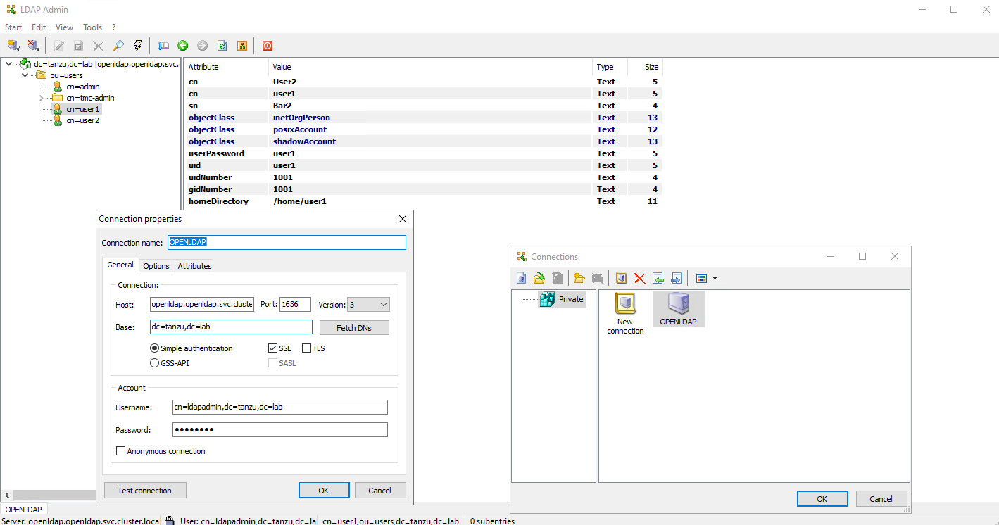
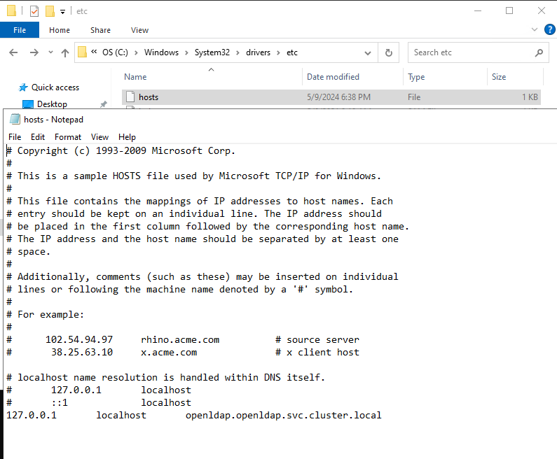

# OpenLDAP in K8S for Tanzu services

This manifest (openldap_k8s.yaml) deploys a lightweight openldap server in a K8S cluster. It will create a service with the following FQDN ```openldap.openldap.svc.cluster.local``` listening on port ```1636``` over TLS

The intention of this Openldap service is to be used for Tanzu services such as TMC SM or HUB SM. For the time being, the configuration is set for TMC SM.

It is only creating a ```tmc-admin``` group, which needs to be referenced in the tmc values.yaml file at install time with the ```idpGroupRoles.admin``` property, and the following users/passwords: 

* admin/admin
* user1/user1
* user2/user2

The yaml manifest  is creating 2 different secrets.
* openldap-creds is defining the created users, passwords and the ldapadmin user password.
* certs-secret is encoding 3 files in BASE64. the CA file and a key and certificate that must be signed by that CA, for the openldap TLS connections. 
The openldap certitifate will need to have this CN: ```openldap.openldap.svc.cluster.local```

After applying this manifest in your K8S cluster, you can connect to the ldap server and modify the users to include an email if needed (required for TMC SM <= 1.1.0), or even create new groups such as ```tmc-member```, which is not created when applying the manifest. 

I'm using the [LDAP Admin](http://ldapadmin.org) OS tool to do that, but you can use any other of your convenience.



**NOTE:** To use the LDAP Admin tool, I created a port forward from my workstation to the openldap service, and included an alias to localhost in my /etc/hosts file:

```
kubectl port-forward svc/openldap -n openldap 1636:1636
```



To apply the manifest you only need to run the following command. It will take care of creating the namespace and all the required objects (secrets, deployment and service). 

```
kubectl apply -f openldap_k8s.yaml
```

## TMC SM values.yaml ldap configuration

After the openldap service is Up&Running, you can replace the ldap section in your values.yaml file for TMC with the following one, and update the tanzu-mission-control package

```
ldap:
  domainName: "tanzu.lab"
  groupBaseDN: "dc=tanzu,dc=lab"
  groupSearchFilter: "(&(objectclass=groupOfNames)(member={}))"
  host: "openldap.openldap.svc.cluster.local:1636"
  password: "<ldap admin user password>"
  type: "ldap"
  userBaseDN: "dc=tanzu,dc=lab"
  userSearchFilter: "(&(objectclass=inetOrgPerson)(uid={}))"
  username: "cn=ldapadmin,dc=tanzu,dc=lab"
  rootCA: |
    -----BEGIN CERTIFICATE-----
    <Replace with root CA certificate data>
    -----END CERTIFICATE-----
```

To update the tanzu-mission-control manifest, you can run:

```
tanzu package installed update tanzu-mission-control --version <TMC SM VERSION> -n tmc-local --values-file values.yaml
```